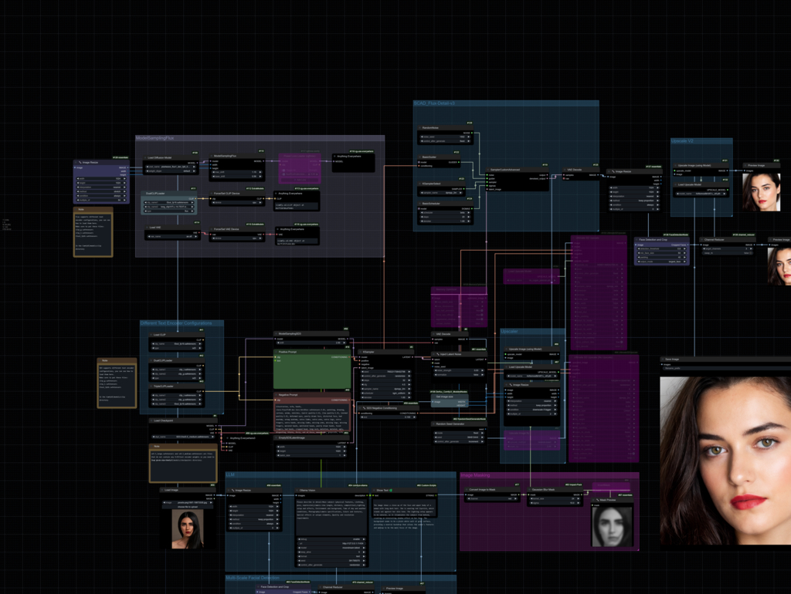
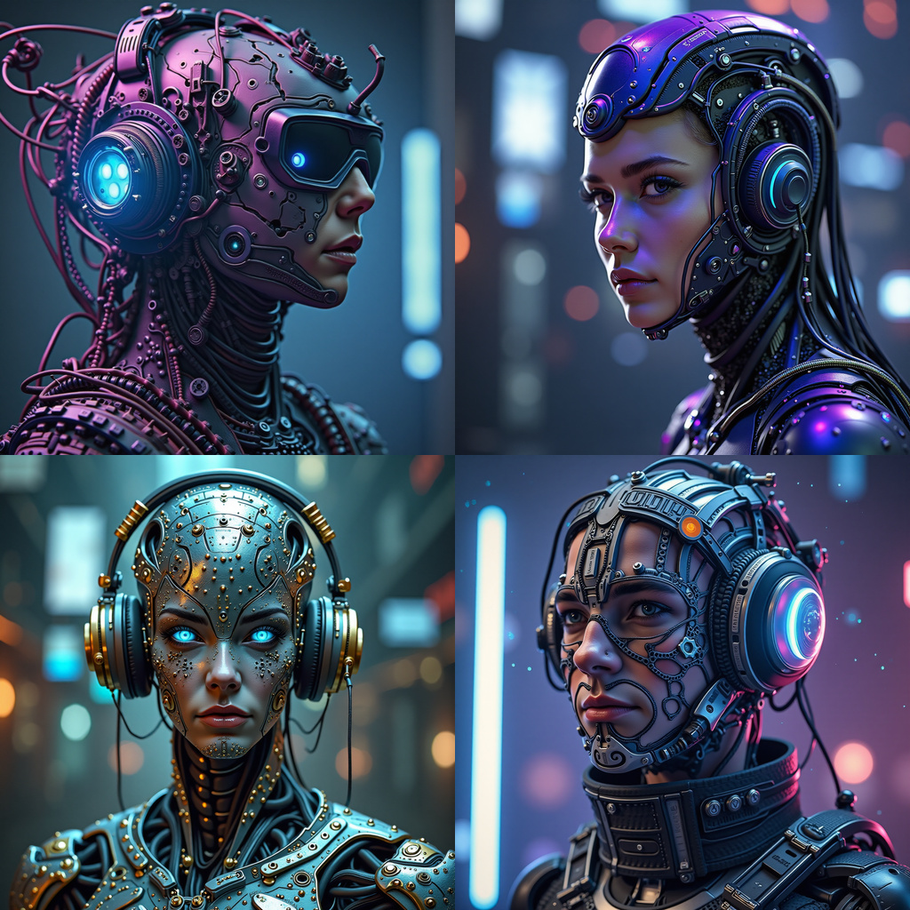
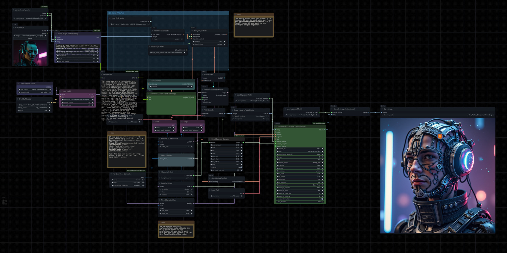

# ComfyUIWorkflowSuite 🎨

Streamlined ComfyUI workflows.

## Installation

## For Steerable Motion

Please use this fork of Steerable Motion: [Steerable Motion Fork](https://github.com/Limbicnation/Steerable-Motion/commit/78e1b0eaa26c2fd5f9f8ab9985e6ee198f9ebfac). Download the `steerable-motion` directory and place it in your `custom-nodes` directory.

Note: You might need these [tools](https://github.com/Limbicnation/ComfyUINodeToolbox/tree/main/ComfyUI_RandomSeedGeneratorNode) to avoid errors. Please also ensure to place the following tools in your `custom-nodes` directory:
- [Ensure 3 Channel Image](https://github.com/Limbicnation/ComfyUINodeToolbox/tree/main/ComfyUI_Ensure_3_Channel_Image)
- [Random Seed Generator Node](https://github.com/Limbicnation/ComfyUINodeToolbox/tree/main/ComfyUI_RandomSeedGeneratorNode)

## Image Processing Workflow

Below are examples of the image processing workflow, showcasing the transition from low-resolution images to high-resolution outputs.

### Low Resolution to High Resolution

<table>
  <tr>
    <td></td>
    <td></td>
  </tr>
</table>

### [Workflow Diagram](https://github.com/Limbicnation/ComfyUIWorkflowSuite/blob/main/workflows/basic-image-upscaler.png)

### [Resized Face Analysis Using DLib](https://github.com/Limbicnation/ComfyUIWorkflowSuite/blob/main/workflows/face-analysis-dlib-ip-adapter-workflow-v3.png) (based on the work by [Matteo](https://github.com/cubiq))

<table>
  <tr>
    <td></td>
    <td></td>
  </tr>
</table>

### [Naive Bayes Probability-Based Characters](https://github.com/Limbicnation/ComfyUIWorkflowSuite/blob/main/workflows/Naive-Bayes-Probability-Based-Characters.png)

<table>
  <tr>
    <td></td>
    <td></td>
  </tr>
</table>

### [Mad Scientist Workflow](https://github.com/Limbicnation/ComfyUIWorkflowSuite/blob/main/workflows/mad-scientist-scifi-character-v1.png)
<table>
  <tr>
    <td></td>
    <td></td>
  </tr>
</table>

### Canny Edge Detection and UV Polygon Inpainting [workflow](https://github.com/Limbicnation/ComfyUIWorkflowSuite/blob/main/workflows/Inpaint_From_Canny_Lines_v1.json)

<table>
  <tr>
    <td></td>
    <td></td>
  </tr>
</table>

### Depth ControlNet IP Adapter v3 Workflow [workflow]( https://github.com/Limbicnation/ComfyUIWorkflowSuite/blob/main/workflows/depth-workflow-controlnet-ip-adapter-v2.png)

<table>
  <tr>
    <td></td>
    <td></td> 
  </tr>
</table>

### FLUX Inpaint [workflow](https://github.com/Limbicnation/ComfyUIWorkflowSuite/blob/main/workflows/Flux_Image2Image_Inpaint_V2.png)

<table>
  <tr>
    <td></td>
    <td></td> 
  </tr>
</table>

### [Flux Character Creator V2](https://github.com/Limbicnation/ComfyUIWorkflowSuite/blob/main/workflows/Flux_Character_Creator_V2.png)

<table>
  <tr>
    <td></td>
    <td></td>
  </tr>
</table>

### [Portrait Flux Face Enhanced](https://github.com/Limbicnation/ComfyUIWorkflowSuite/blob/main/workflows/Portrait-Flux-FaceEnhanced-v6.json)

<table>
  <tr>
    <td></td>
    <td></td>
  </tr>
</table>

### [Redux Janus Ultimate Upscale](https://github.com/Limbicnation/ComfyUIWorkflowSuite/blob/main/workflows/Fluix_Redux_Cyberpunk_NeoCore_V5.png)
<table>
  <tr>
    <td></td>
    <td></td>
  </tr>
</table>
